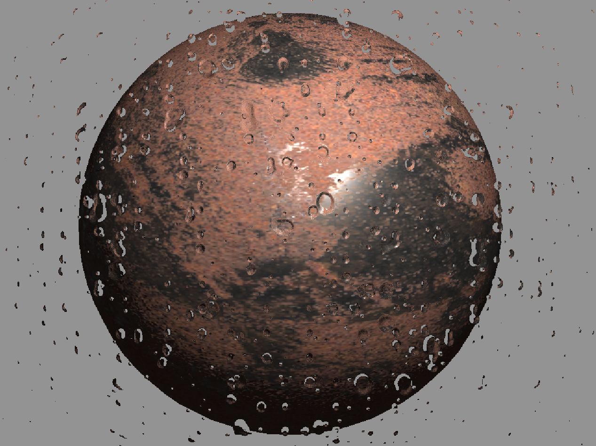

# Vapor 3D Engine

高性能、可编程的 **多阶段渲染管线 (Multi-Stage Pipeline)** 框架。

---

> **TODO**: 扩展处于测试阶段，可能会有各种问题。文档目前仅为大纲，我有时间再来写详细使用方法。

---

## 核心特性

* **完全可编程管线**：引擎不内置任何渲染算法。开发者可完全接管并自定义 Shader 逻辑。
* **自定义渲染阶段**：引擎框架设计支持高效的中间数据交换，支持延迟渲染、G-Buffer 架构及代理几何体等高级技术的二次开发。

## 渲染效果

* 可前往 example/ 查看我最近在写的一些二次开发作品，均采用MIT开源

## 提示

> `example/pbr.sb3` 示例中使用的 PBR 贴图来源于 FreePBR.com。该资源遵循其官方授权协议，仅供学习与非商业演示使用。
> `example/pbr.sb3` 示例中使用的 IBL 预卷积贴图来源于 cmftStudio 官方示例资源。该资源版权归原作者所有，仅供学习与非商业演示使用。

**By: Joy_Ful** | License: MPL-2.0
